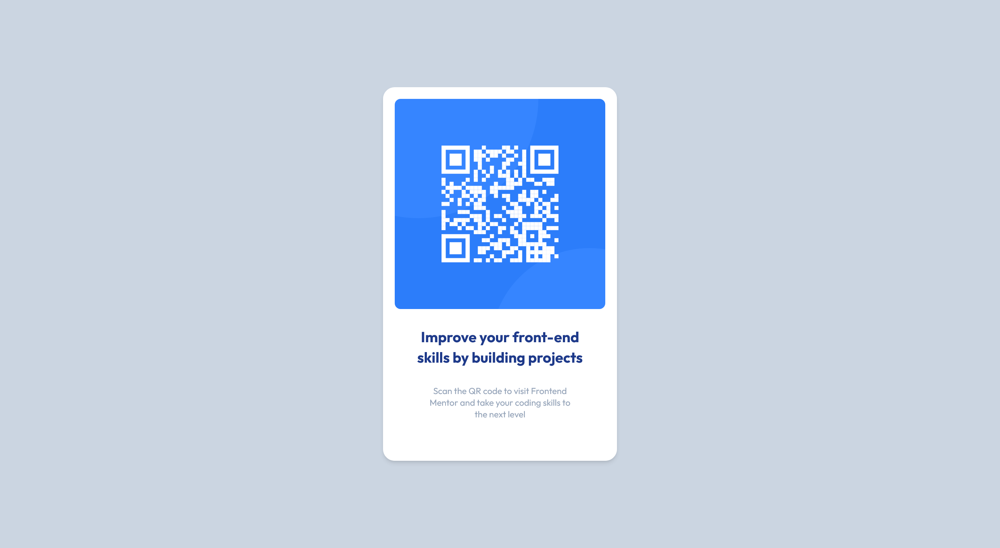

# Frontend Mentor - QR code component solution

This is a solution to the [QR code component challenge on Frontend Mentor](https://www.frontendmentor.io/challenges/qr-code-component-iux_sIO_H). Frontend Mentor challenges help you improve your coding skills by building realistic projects.

## Table of contents

- [Overview](#overview)
  - [Screenshot](#screenshot)
  - [Links](#links)
- [My process](#my-process)
  - [Built with](#built-with)
  - [What I learned](#what-i-learned)
  - [Continued development](#continued-development)
  - [Useful resources](#useful-resources)
- [Author](#author)

## Overview

### Screenshot

### Links

- Solution URL: (https://github.com/djbedford/fm-qr-code)
- Live Site URL: (https://scintillating-dango-934289.netlify.app)

## My process

### Built with

- Semantic HTML5 markup
- CSS Grid
- [Tailwind CSS](https://tailwindcss.com/) - Utility-first CSS framework

### What I learned

Completing this project has allowed me to begin learning the basics of using a utility-first approach to styling by using the Tailwind CSS framework.

### Continued development

Going forward I will continue learning about the utility-first approach to design by implementing Tailwind CSS into my projects. This will allow me to become more confident and proficient at executing the desired look for a project.

### Useful resources

- [Tailwind CSS docs](https://tailwindcss.com/docs/installation) - This helped me to get set up and start using a utility-first approach to completing this project.

## Author

- Frontend Mentor - [@djbedford](https://www.frontendmentor.io/profile/djbedford)
- Twitter - [@djbedford](https://www.twitter.com/djbedford)
